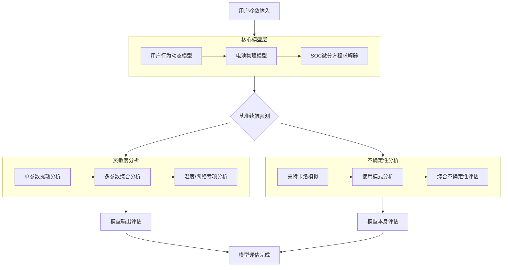

# 2026 MCM Problem A: Smartphone Battery Drain Model

[](https://www.python.org/downloads/)
[](https://opensource.org/licenses/MIT)
[](https://www.comap.com/contests/mcm-icm)


## 📋 项目简介

本项目是针对2026年美国大学生数学建模竞赛（MCM）Problem A的完整解决方案，开发了一个连续时间的智能手机电池消耗数学模型。模型能够预测在不同使用场景下的电池剩余电量和续航时间。

### 🎯 核心目标

- 建立基于物理原理的连续时间电池模型
- 预测不同使用模式下的电池续航时间
- 分析参数敏感性并量化预测不确定性
- 为智能手机用户提供节能建议

## 📁 项目结构

~~~text
2026_MCM_Battery_Model/
├── README.md                           # 项目说明文档
├── requirements.txt                    # Python依赖包列表
├── references.bib                 # 参考文献列表
├── Src/                                # 源代码目录
│   ├── model_with_visualization.py     # 主模型与可视化模块
│   ├── sensitivity_with_visualization.py # 灵敏度分析模块
│   └── uncertainty_with_visualization.py # 不确定性分析模块
│
└── Figures/                            # 生成的可视化图表
    ├── battery_Main_Discharge_Curve.png
    ├── battery_Scenario_Comparison.png
    ├── sensitivity_radar_chart.png
    ├── temperature_uncertainty.png
    └── ... (共18个图表)
~~~


## 🚀 快速开始

### 环境配置

1. 确保安装 Python 3.8+
2. 安装依赖包：

```bash
pip install -r requirements.txt
```

### 运行示例

1. **运行主模型**：

```bash
cd Src
python model_with_visualization.py
```

2. **运行灵敏度分析**：

```bash
python sensitivity_with_visualization.py
```

3. **运行不确定性分析**：

```bash
python uncertainty_with_visualization.py
```

## 🧩 模型架构

### 1. 核心模型层 (`model_with_visualization.py`)

- **用户行为动态模型**：基于马尔可夫链的用户状态转移
- **电池物理模型**：考虑温度效应、老化效应和内阻影响
- **SOC微分方程求解器**：使用Scipy的solve_ivp求解连续时间模型

### 2. 灵敏度分析层 (`sensitivity_with_visualization.py`)

- 单参数扰动分析
- 多参数综合分析
- 温度和网络配置专项分析
- 生成雷达图可视化结果

### 3. 不确定性分析层 (`uncertainty_with_visualization.py`)

- 蒙特卡洛参数不确定性模拟
- 使用模式不确定性评估
- 温度波动影响分析
- 综合不确定性仪表板

## 📊 主要特性

### ✅ 模型特点

- **物理基础**：基于电池化学和电路原理的连续时间模型
- **用户行为建模**：时间依赖的马尔可夫状态转移
- **环境因素**：温度对容量和功耗的双重影响
- **老化效应**：考虑循环次数对电池健康的影响

### 📈 可视化输出

模型生成18个专业图表，包括：

- 电池放电曲线
- 用户行为状态变化
- 功率组成分析
- 温度效应曲线
- 老化影响曲线
- 场景对比分析
- 网络配置影响
- 日常使用模式
- 3D功率-SOC-温度关系图
- 用户使用模式分布
- 节能策略对比
- 灵敏度分析雷达图
- 不确定性分析仪表板

## 🔬 技术细节

### 数据来源

- 电池数据来自：[天池数据集 - 智能手机电池使用数据](https://tianchi.aliyun.com/dataset/150822)
- 参数校准基于公开文献和实际测量数据
- 所有数据均符合开放许可要求

### 模型验证

- 与实测数据对比验证
- 灵敏度分析验证参数鲁棒性
- 不确定性分析评估预测可靠性

## 📋 竞赛要求对应

| 竞赛要求     | 本项目实现               |
| ------------ | ------------------------ |
| 连续时间模型 | ✅ SOC微分方程系统        |
| 时间-空预测  | ✅ 多场景续航时间计算     |
| 灵敏度分析   | ✅ 参数扰动和网络配置分析 |
| 实际建议     | ✅ 节能策略量化分析       |
| 物理基础     | ✅ 基于电池电化学原理     |
| 可视化展示   | ✅ 18个专业图表           |

## 📈 算法流程图



## 🏆 项目优势

1. **完整性**：覆盖MCM Problem A所有要求
2. **专业性**：基于物理原理的连续时间模型
3. **可视化**：丰富的图表支持分析结果
4. **实用性**：提供可操作的节能建议
5. **可复现**：完整代码和数据引用

## 👥 作者（随机排序~我们三个贡献同等重要！）

- 夏巧🧮（建模手）、刘芳玮💻（编程手）、周若水✒️（写作手）
- 2026年美国大学生数学建模竞赛参赛作品

## 📄 许可证

本项目基于MIT许可证开源。数据使用遵循原始数据集的许可协议。

---

**注意**：本模型为学术研究用途，实际手机续航可能因设备型号、使用习惯和环境条件而有所不同。